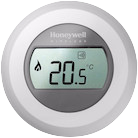
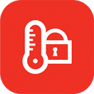
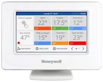

<span align="center">

&nbsp;&nbsp;
&nbsp;&nbsp;


# Honeywell Evohome support for Homebridge


[](https://github.com/homebridge/homebridge/wiki/Verified-Plugins)


</span>

This ia a plugin to integrate [Honeywell Evohome](https://getconnected.honeywellhome.com/de/thermostate/evohome) into Apple HomeKit. It is work in progress. Help is greatly appreciated!

Up until now this plugin will only add your Thermostats and central functions (for example "ECO") to Homebridge. Other devices such as domestic hot water will probably follow in the future once we can wrap our heads arround it (and have someone to test it out).

## 🚀 Getting Started

**Homebridge with [Config UI X](https://github.com/oznu/homebridge-config-ui-x):**
1. Go to the "Plugins" tab and search for `homebridge-evohome`
2. Install the plugin and fill out the setup form

**Terminal / NPM:**
1. Install this plugin using `npm install -g homebridge-evohome@latest`
2. Update your configuration file ([sample-config below](https://github.com/luc-ass/homebridge-evohome#%EF%B8%8F-configuration))

## ⚙️ Configuration

Configuration sample:

```json
"platforms": [
        {
            "platform": "Evohome",
            "name" : "Evohome",
            "username" : "username/email",
            "password" : "password",
            "temperatureUnit" : "Celsius",
            "locationIndex" : "0"
        }
    ]
```

| Parameter          | optional | accepted values               | info |
| :--                | :--      | :--                           | :-- |
| `platform`         | no       | `Evohome`                       | |
| `name`             | no       | *any Name you want*           | |
| `username`         | no       | *your Honeywell email adress* | |
| `password`         | no       | *your Honeywell password*     | |
| `temperatureUnit`  | yes      | `Celsius`, `Fahrenheit`           | defaults to `Celsius` |
| `locationIndex`    | yes      | `0`, `1`, `2`, etc.                 | only needed if you have multiple locations |
| `switchAway`       | yes      | `true`,  `false`                   | creates a switch for away mode |
| `switchDayOff`     | yes      | `true`,  `false`                   | creates a switch for day off mode |
| `switchEco`        | yes      | `true`,  `false`                   | creates a switch for eco settings |
| `switchHeatingOff` | yes      | `true`,  `false`                   | creates a switch to tur off the heating |
| `switchCustom`     | yes      | `true`,  `false`                   | creates a switch for your custom mode |


## 📝 Roadmap

- [x] Get device names
- [x] Read temperature
- [x] Update temperature
- [x] Set target temperature (credits to @zizzex)
- [x] Change temperature until next scheduled event (credits to @fredericvl). This feature sets the temperature until the next scheduled event on the same day. If there is no event on the same day it will be scheduled until 00:00:00. As this is a new feature it contains advanced logging. Please post your log if you encounter any problems.
- [x] Make use of Elgato Eve graphs (using fakegato-history) including automatic updating (credits to @rooi)
- [x] Add "global device" to add Away/Energy saving etc. (credits to @fredericvl)
- [x] Add support for multiple locations. (credits to @ebarnard)
- [x] Add support for Honeywell Round Connected
- [ ] Add "DOMESTIC_HOT_WATER" with matching characteristics. This device will now be ignored to prevent errors (credits to @sOckhamSter).

## ⚠️ Known Issues & Notes

- System time/time zone must be the same as the time on your evohome controller or else schedules will work in unexpected ways.
- Your password may not contain `&` or else the login will fail.
- Updating from `<0.5.1` to `>0.6.0` will create new devices and put them into the standard room of your home. They just need to be moved back to their rooms. This is expected behaviour as the UUID has changed. Historic data will be retained. This can also happen without a clear cause. It is under investigation here: [#61](../../issues/61).

## 🧪 Beta Testing

This part talks about testing pre-release version of the plugin. I strongly recommend, that you don't do this in your production environment. It will frequently reset accessories and break automations. If you still want to or have been asked to, this is my preferred way of installing from github:

In Homebridge Config UI X Terminal:

```sh
# go to node module directory
cd node_modules
# remove homebridge-evohome and contents
rm -r homebridge-evohome
# recreate the folder
mkdir homebridge-evohome
# clone repo to folder
git clone https://github.com/luc-ass/homebridge-evohome.git ./homebridge-evohome
# cd into folder
cd homebridge-evohome
# install plugin
npm install
```
Now restart Homebridge
