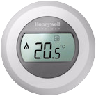
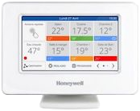

<span align="center">

&nbsp;&nbsp;
&nbsp;&nbsp;


# Honeywell Evohome support for Homebridge


[](https://github.com/homebridge/homebridge/wiki/Verified-Plugins)

</span>

Brings [Honeywell Evohome](https://getconnected.honeywellhome.com) heating zones,
system modes and domestic hot water into Apple HomeKit.

Version 1.0 is a rewrite for **Homebridge 2**. Please read
[Upgrading from 0.11.x](#-upgrading-from-011x) before you install it.

## 📖 Contents

- [Requirements](#-requirements)
- [Getting started](#-getting-started)
- [Configuration](#-configuration)
  - [Several homes on one account](#several-homes-on-one-account)
  - [How long a temperature change applies (`setpointMode`)](#how-long-a-temperature-change-applies-setpointmode)
  - [What HomeKit shows](#what-homekit-shows)
  - [Faults and batteries](#faults-and-batteries)
- [Upgrading from 0.11.x](#-upgrading-from-011x)
- [Known limitations](#-known-limitations)
- [Troubleshooting](#-troubleshooting)
- [Testing a pre-release](#-testing-a-pre-release)
- [Contributing](#-contributing)

## 📋 Requirements

|            |                                                                             |
| :--------- | :-------------------------------------------------------------------------- |
| Homebridge | 2.0.0 or newer                                                              |
| Node.js    | 22, 24 or 26                                                                |
| Account    | Honeywell/Resideo credentials from <https://getconnected.honeywellhome.com> |

Homebridge 1.x is no longer supported. If you are still on 1.x, stay on
`homebridge-evohome@0.11.2` until you upgrade.

## 🚀 Getting started

**Homebridge UI:** search for `homebridge-evohome` under _Plugins_, install it
and fill in the form.

**Terminal:**

```sh
npm install -g homebridge-evohome@latest
```

Then add a platform block to your `config.json` — see below.

## 🔧 Configuration

Minimal configuration:

```json
"platforms": [
  {
    "platform": "Evohome",
    "name": "Evohome",
    "username": "you@example.com",
    "password": "your-password"
  }
]
```

| Option                  | Default             | Description                                                                                                                       |
| :---------------------- | :------------------ | :-------------------------------------------------------------------------------------------------------------------------------- |
| `platform`              | —                   | Must be `Evohome`                                                                                                                 |
| `name`                  | `Evohome`           | Shown in the log, used as the prefix for switch names                                                                             |
| `username`              | —                   | Your Honeywell email address                                                                                                      |
| `password`              | —                   | Your Honeywell password                                                                                                           |
| `locationId`            | —                   | Only for accounts with several homes. Every location is printed in the log at startup, and the ID is **stable**, unlike the index |
| `locationIndex`         | `0`                 | Fallback when no `locationId` is set                                                                                              |
| `pollIntervalSeconds`   | `300`               | How often the status is fetched. Values below 60 are raised to 60                                                                 |
| `setpointMode`          | `keepExistingUntil` | How long a temperature change applies — see below                                                                                 |
| `temperatureAboveAsOff` | `false`             | Show a zone as off when the room is warmer than the target. Display only                                                          |
| `logTemperatureChanges` | `false`             | Log every change of a room temperature                                                                                            |
| `history`               | `true`              | Record history for the Elgato Eve app                                                                                             |
| `switchAway`            | `true`              | Show an "Away" switch                                                                                                             |
| `switchDayOff`          | `true`              | Show a "Day Off" switch                                                                                                           |
| `switchEco`             | `true`              | Show an "Eco" switch                                                                                                              |
| `switchHeatingOff`      | `true`              | Show a "Heating Off" switch                                                                                                       |
| `switchCustom`          | `true`              | Show a "Custom" switch                                                                                                            |

### Several homes on one account

One platform block covers one location — `locationIndex` names a single
position, and `"locationIndex": 0,1` is not valid JSON. A second home needs a
second block, **and each block needs its own child bridge**: Homebridge hands
the cached accessories to only one platform of a given name, so two `Evohome`
blocks on the same bridge would recreate each other's accessories on every
start. In the Homebridge UI: the plugin's menu → _Bridge Settings_, once per
block. The plugin says so in the log if you forget.

Every location is listed at startup with its ID, which is what belongs in
`locationId`:

```
[Evohome] The account has 2 locations: Home (locationId 1234567), Cottage (locationId 7654321). Using "Home" …
```

```json
{
  "platform": "Evohome",
  "name": "Evohome Home",
  "username": "you@example.com",
  "password": "your-password",
  "locationId": "1234567",
  "_bridge": { "username": "0E:11:22:33:44:55", "port": 51820 }
},
{
  "platform": "Evohome",
  "name": "Evohome Cottage",
  "username": "you@example.com",
  "password": "your-password",
  "locationId": "7654321",
  "_bridge": { "username": "0E:11:22:33:44:66", "port": 51821 }
}
```

### How long a temperature change applies (`setpointMode`)

HomeKit has no concept of "until", so the rule is set once in the configuration.

| Value                           | Behaviour                                                                                                                                                        |
| :------------------------------ | :--------------------------------------------------------------------------------------------------------------------------------------------------------------- |
| `keepExistingUntil` _(default)_ | If a temporary override is already running, its end time is preserved and only the temperature changes. Otherwise the change applies until the next switchpoint. |
| `untilNextSwitchpoint`          | Always until the next switchpoint. This is what 0.11.2 and earlier did.                                                                                          |
| `permanent`                     | Applies until you pick **Auto** in HomeKit.                                                                                                                      |

Turning a thermostat **off** always writes a permanent override — a zone you
switched off should not come back on at the next switchpoint.

### What HomeKit shows

| HomeKit state | Meaning                               |
| :------------ | :------------------------------------ |
| **Auto**      | The zone follows the Evohome schedule |
| **Heat**      | An override is active                 |
| **Off**       | The target is at the zone's minimum   |

### Faults and batteries

Evohome reports an `activeFaults` list per zone and for the hot water. Those
faults now reach HomeKit instead of only the log:

| Fault reported by Evohome                               | In HomeKit                                                   |
| :------------------------------------------------------ | :----------------------------------------------------------- |
| Low battery, e.g. `TempZoneActuatorLowBattery`          | Low battery on that accessory — the Home app shows a warning |
| Anything else, e.g. `TempZoneActuatorCommunicationLost` | A fault on the accessory (`StatusFault`)                     |

A low battery deliberately does **not** count as a fault: an HR92 with a weak
battery still measures and still heats. Only a real failure — radio link lost,
sensor defective — makes the values untrustworthy.

The battery level knows only two values. The API reports whether a battery is
low, never how full it is, so a zone shows 100 % while nothing is reported and
10 % once Evohome says the battery is low — below the threshold at which clients
warn. Publishing no level at all was worse: apps render the missing value as
0 %, which looks like a dead battery on hardware that is fine. The charging
state is "not chargeable", which is what an HR92 on AA cells is.

Every zone gets a battery status, including mains-powered ones such as a zone
valve; those simply never report a battery fault.

Faults are logged as well, both when they appear and when they clear.

## 🔄 Upgrading from 0.11.x

**Your accessories are recreated once.** They appear in the default room and
need to be moved back; scenes and automations must be recreated.

This is deliberate. Until now the accessory identity was derived from the
_position_ of a zone in Honeywell's response, so adding or reordering a zone
silently renamed every following device — the cause of accessories vanishing for
no obvious reason. Identity is now derived from the zone ID and stays stable.

Two options were removed and are ignored with a note in the log:

- **`childBridge`** — it only suppressed an error path. A dynamic platform keeps
  its accessories on failure anyway, so a child bridge is no longer needed for
  this.
- **`temperatureUnit`** — HomeKit takes the display unit from the iOS device.

## 🚧 Known limitations

- **Thermostats appear under "Humidity" in the Home app.** The HomeKit
  thermostat service declares humidity as an optional characteristic, and the
  Home app groups by service, not by what the device actually reports. Nothing
  in the plugin can change this ([#130](../../issues/130)).
- **Domestic hot water has no history graph.** The API exposes no target
  temperature for hot water, and inventing one produces a misleading curve.
- **Schedules use the location's UTC offset** as reported by the API, re-read
  once a day. The API only provides Windows time zone identifiers, which cannot
  be resolved properly, so the offset cannot be computed locally — between a
  daylight-saving change and the next refresh, a switchpoint may be off by an
  hour.
- The Evohome security system (Total Connect 2.0E) is a different product and is
  not supported ([#83](../../issues/83)).

## 🩺 Troubleshooting

**`Unexpected API response at "…"`** — Honeywell returned something the plugin
did not expect. The path in the message says which field was missing. Please
open an issue with that line.

**Plugin fails to start with an error from `googleapis`** — that package is
pulled in by `fakegato-history`, which powers the Eve graphs. Set
`"history": false` and it is never loaded ([#166](../../issues/166)).

**Login fails repeatedly** — the plugin retries with a growing delay and
re-authenticates when the session expires. It gives up only on rejected
credentials, to avoid running into Honeywell's rate limit.

## 🧪 Testing a pre-release

```sh
npm install -g homebridge-evohome@beta
```

Pre-releases are published under the `beta` tag, so a plain
`npm install homebridge-evohome` keeps giving you the stable version. Reports
are very welcome.

## 🤝 Contributing

Development notes live in [`docs/`](docs/):
[ARCHITECTURE.md](docs/ARCHITECTURE.md) describes version 0.11.2,
[MIGRATION-HB2.md](docs/MIGRATION-HB2.md) the rewrite,
[TESTING.md](docs/TESTING.md) how to run it locally.

```sh
npm install
npm run check     # lint, typecheck, tests
npm run dev       # build and start Homebridge against this repo
```

Credits for version 1.0: [@MGMsystems](https://github.com/MGMsystems) for
[#207](../../pull/207), which showed how to build the custom characteristics for
HAP 2.x, and [@PuzzledUser](https://github.com/PuzzledUser) for
[#204](../../pull/204) and the analysis in [#149](../../issues/149). Earlier
contributions by @zizzex, @fredericvl, @rooi, @ebarnard and @sOckhamSter are
what made this plugin work in the first place.
